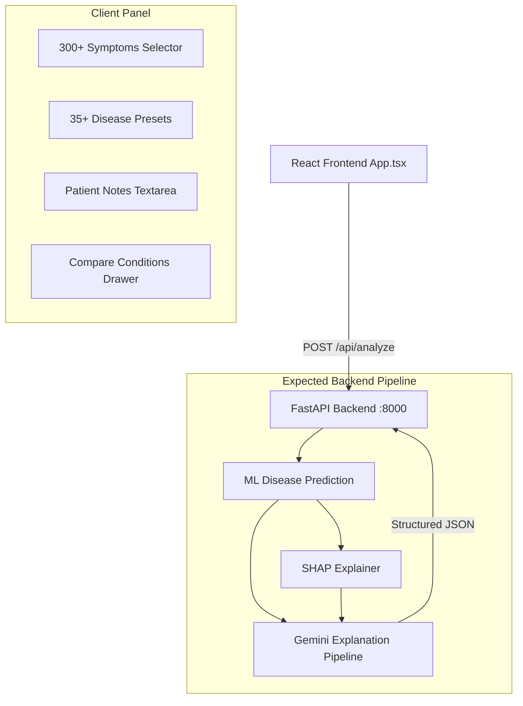

# MedExplain AI: Architectural & Feasibility Analysis

This document provides a comprehensive analysis of the MedExplain AI frontend and outlines the system architecture, datasets, machine learning (ML), SHAP explanation, and Gemini LLM pipeline required to build the backend.

---

## 1. Current Architecture Overview

The system is currently composed of a single-page React frontend (`App.tsx`) running on the client side. The frontend handles all symptom selection and presentation of results.



---

## 2. Frontend Dependencies

Based on the provided React source code, the required frontend dependencies include:
*   **React (>= 18.0.0)**: Uses core React hooks (`useState`, `useRef`, `useEffect`).
*   **Modern CSS / Fonts**: Uses the **Sora** font family, styled using inline CSS objects with custom color definitions (`C`).
*   **UI Components**: Uses browser native form elements, SVG/Emoji icons, and a custom window width hook (`useWidth`) to support responsive layouts down to mobile screens (`< 768px`).

---

## 3. Current API Contract

The React application makes a `POST` request to `http://localhost:8000/api/analyze`.

### Request Payload (`POST /api/analyze`)
```json
{
  "symptoms": [
    {
      "name": "Cough",
      "duration": "1–3 days"
    },
    {
      "name": "Fever",
      "duration": "< 1 day"
    }
  ],
  "notes": "Patient is a 45-year-old male with a history of mild asthma."
}
```

### Expected Response Payload
The frontend expects a single JSON object matching the following structure:

```json
{
  "differentials_note": "A clinical summary generated by the AI system explaining the findings...",
  "conditions": [
    {
      "name": "Pneumonia",
      "confidence": 0.85,
      "confidence_label": "High",
      "icd": "J18.9",
      "prevalence": "Common",
      "typical_duration": "2–4 weeks",
      "urgency": "Urgent", 
      "specialist": "Pulmonologist",
      "contagious": false,
      "key_features": ["Productive cough", "Fever", "Shortness of breath"],
      "matched_symptoms": ["Cough", "Fever"],
      "duration_insight": "Duration matches the typical rapid onset of acute pneumonia.",
      "recommendation": "Seek professional medical evaluation immediately. Chest X-ray recommended.",
      "red_flags_specific": [
        "Shortness of breath on exertion",
        "Pleuritic chest pain"
      ],
      "shap": [
        { "symptom": "Cough", "value": 0.42 },
        { "symptom": "Fever", "value": 0.28 },
        { "symptom": "Headache", "value": -0.05 }
      ]
    }
  ],
  "red_flags": [
    "Difficulty breathing or severe shortness of breath",
    "Persistent chest pain or pressure"
  ],
  "lifestyle_advice": [
    "Stay hydrated and rest.",
    "Monitor oxygen saturation levels if a pulse oximeter is available."
  ],
  "disclaimer": "Educational use only. This tool does not substitute professional medical diagnosis, advice, or treatment."
}
```

---

## 4. Existing Data Structures

Inside the frontend, the following structural structures define the symptoms, options, and presets:

1.  **`SYMPTOM_CATS`**:
    *   Maps **14 Categories** (Respiratory, Systemic, Neurological, Gastrointestinal, Cardiovascular, Musculoskeletal, Skin, Eyes/ENT, Endocrine, Hematological, Urological, Mental Health, Pediatric, Reproductive) to a list of **300+ specific symptoms**.
2.  **`DURATION_OPTIONS`**:
    *   `["< 1 day", "1–3 days", "4–7 days", "1–2 weeks", "2–4 weeks", "1–3 months", "3–6 months", "> 6 months", "Chronic / recurring"]`
3.  **`PRESETS`**:
    *   A lookup dictionary for **35 disease presets** (e.g., Influenza, COVID-19, Stroke, Diabetes T2) mapping to their classic constellation of symptoms.
4.  **`urgencyColors`**:
    *   Color mapping for risk tiers: `Routine` (`#00c87a`), `Urgent` (`#ffb830`), and `Emergency` (`#ff4d6a`).

---

## 5. Security & Architectural Gaps

### Security Analysis
*   **Unsent API Key**: The frontend has state for an API key (`apiKey`), but it is not passed to the FastAPI server. In production, requests should be authenticated using JWTs, OAuth2, or API Keys in custom request headers (`X-API-Key`).
*   **Sensitive Patient Data Transmissions**: Symptom inputs and free-text notes can contain HIPAA-protected Health Information (PHI). If transmitted over plain HTTP, this poses severe privacy risks. All communication must enforce **HTTPS (TLS 1.3)**.
*   **CORS Configuration**: The frontend runs on a separate port (typically 3000/5173) than the backend (8000). Proper Cross-Origin Resource Sharing (CORS) headers must be configured on the FastAPI app.

### System Gaps
*   **No Backend implementation**: There is currently no web server listening on port 8000.
*   **Missing ML Classifier & Dataset**: No ML model is trained to process 300+ sparse binary/duration symptom features and output probability estimates across conditions.
*   **Missing SHAP Engine**: No feature attribution engine is integrated to compute the contribution of positive or negative symptoms to the model's decisions.
*   **Missing LLM Orchestration**: The Gemini API has not been wired up to generate context-specific clinical explanations, duration insights, lifestyle recommendations, and red flags.

---

## 6. Required Target Backend Architecture

To fulfill the target pipeline (`React -> FastAPI -> ML Prediction -> SHAP -> Gemini Explanation -> JSON -> React`), the backend must implement the following components:

### A. FastAPI Architecture
*   **Pydantic Models**:
    *   `SymptomInput`: Validate `{ name: string, duration: string }`.
    *   `AnalyzeRequest`: Validate `{ symptoms: List[SymptomInput], notes: Optional[str] }`.
    *   `ShapImpact`: `{ symptom: str, value: float }`.
    *   `ConditionDifferential`: Detailed Pydantic structure for conditions, matching the frontend expectation.
    *   `AnalyzeResponse`: Complete structure including `differentials_note`, `conditions`, `red_flags`, `lifestyle_advice`, and `disclaimer`.
*   **CORS Middleware**: Set up to allow frontend origins.
*   **Error Handlers**: Structured HTTP exceptions mapping back to JSON error messages.

### B. Machine Learning (ML) Architecture
To output real probabilities and allow local SHAP explanations, we need an actual ML classifier.
*   **Dataset Sourcing**:
    *   Since we cannot fabricate datasets, we will establish a structured mapping based on clinical guidelines (mirroring the `PRESETS` profiles and `SYMPTOM_CATS` distributions) to synthesize a training set of patient profiles, or load a standardized public disease-symptom dataset (e.g. SymCat or similar open-source medical diagnostics dataset).
    *   *Alternative*: We can build a probabilistic expert system or a lightweight classifier trained on synthetic patient cases built from the `PRESETS` definition combined with noise (irrelevant symptoms) to emulate a realistic ML model trained on medical records.
*   **Feature Vectorization**:
    *   Map the incoming symptom list to a static 1D feature array of length ~300 (one-hot encoded based on the exact keys of `SYMPTOM_CATS`).
*   **Model**:
    *   A Multi-label Random Forest Classifier or XGBoost Classifier trained to predict probabilities for the 35+ target diseases.

### C. SHAP Explanation Architecture
*   **Explainer**:
    *   Utilize `shap.TreeExplainer` on our trained Random Forest/XGBoost model.
*   **Local Explanation Extraction**:
    *   For the patient's specific symptom vector, compute the SHAP values (log-odds impact or probability impact) for each of the top predicted conditions.
    *   Extract the values for all features, sort them by absolute impact, and return the positive/negative values for active symptoms.

### D. Gemini Orchestration (LLM Explanation)
*   **SDK**: Use the official `google-generativeai` library.
*   **Structured Output (JSON Mode)**:
    *   Provide Gemini with the user's symptoms, durations, history notes, and the ML predictions (including confidence and SHAP values).
    *   Prompt Gemini to fill in the remaining clinical details: `icd`, `prevalence`, `typical_duration`, `urgency`, `specialist`, `contagious`, `key_features`, `matched_symptoms`, `duration_insight`, `recommendation`, `red_flags_specific`, `red_flags`, `lifestyle_advice`, `disclaimer`, and `differentials_note`.
    *   Enforce Pydantic validation on the LLM output to guarantee zero runtime parsing errors.

---

## 7. Recommended Project Folder Structure

```text
MedExplain/
├── backend/
│   ├── app/
│   │   ├── __init__.py
│   │   ├── main.py                 # FastAPI application and route definitions
│   │   ├── config.py               # Environment configuration (API Keys, Cors)
│   │   ├── models/
│   │   │   └── schemas.py          # Pydantic request/response validation schemas
│   │   ├── services/
│   │   │   ├── ml_service.py       # Vectorization, ML Inference, and SHAP logic
│   │   │   └── gemini_service.py   # Gemini LLM orchestration and prompt engineering
│   │   └── data/
│   │       ├── dataset_builder.py  # Script to compile/synthesize training dataset
│   │       ├── symptom_list.json   # Static mapping of the 300+ features
│   │       └── trained_model.pkl   # Serialized Random Forest model & SHAP explainer
│   ├── requirements.txt            # Python dependencies (fastapi, uvicorn, shap, scikit-learn, google-generativeai, pandas)
│   └── run.py                      # Server launch entry point
├── frontend/
│   ├── src/
│   │   ├── App.tsx                 # Current React frontend code
│   │   └── main.tsx
│   ├── package.json
│   └── vite.config.ts
└── README.md
```
