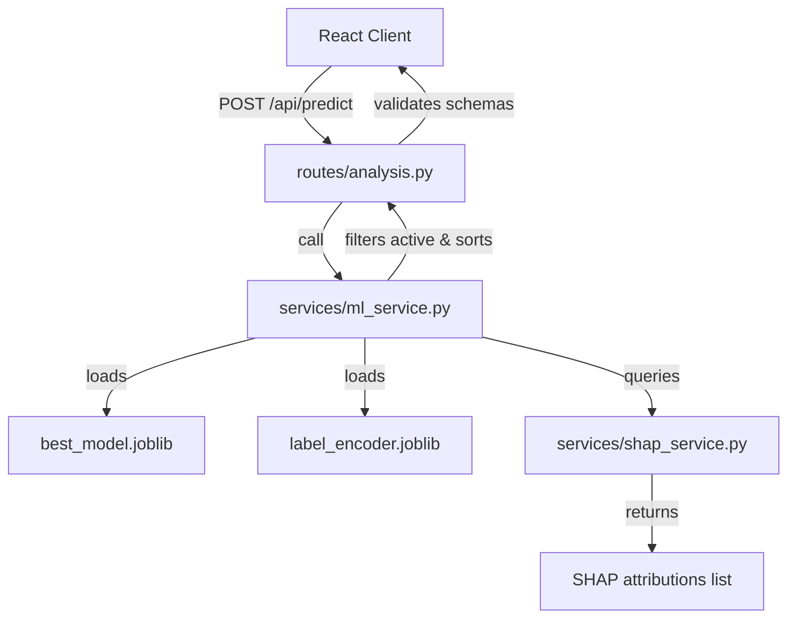

# MedExplain AI: Phase 4 FastAPI Model Integration Report

This report documents the integration of the pre-trained Logistic Regression disease prediction model and SHAP explainability service into the FastAPI backend structure.

---

## 1. API Architecture

The backend integration follows a modular architecture cleanly separating route handlers, Pydantic schemas, and ML inference services:



---

## 2. API Endpoint Specification

### `POST /api/predict`
Predicts the primary disease class along with confidence probability, sorted alternatives probability list, and computes active symptom attributions using SHAP.

#### Request Format
*   **Content-Type**: `application/json`
*   **Body Schema**:
    ```json
    {
      "symptoms": [
        "shivering",
        "high_fever",
        "headache",
        "cough"
      ]
    }
    ```

#### Response Format
*   **Content-Type**: `application/json`
*   **Body Schema**:
    ```json
    {
      "prediction": {
        "disease": "Allergy",
        "confidence": 0.8637
      },
      "alternatives": [
        {
          "disease": "Common Cold",
          "probability": 0.05
        },
        ...
      ],
      "explanation": {
        "supporting": [
          {
            "symptom": "shivering",
            "contribution": 1.8744
          },
          {
            "symptom": "high_fever",
            "contribution": 1.42
          }
        ],
        "against": [
          {
            "symptom": "cough",
            "contribution": -0.1677
          }
        ]
      },
      "disclaimer": "This system provides AI-based educational information and is not a medical diagnosis. Users should consult a qualified healthcare professional."
    }
    ```

---

## 3. Input Validation & Error Handling

*   **Empty Symptoms**: Returns `HTTP 400 Bad Request` with message `"Symptom list cannot be empty."`
*   **Unknown Symptoms**: Returns `HTTP 400 Bad Request` listing all submitted symptom names not present in the 131-symptom training schema (e.g. `"Unknown symptoms detected: non_existent_symptom"`).
*   **Malformed Payload**: Returns `HTTP 422 Unprocessable Entity` for syntax errors or missing required keys.
*   **Unloaded Model State**: Returns `HTTP 503 Service Unavailable` if model parameters are missing from disk.
*   **Runtime Failure**: Returns `HTTP 500 Internal Server Error` if inference or SHAP computation fails.

---

## 4. Test Suite Execution

We implemented and executed an automated integration test suite in [test_predict_api.py](file:///n:/MedExplain/backend/scripts/test_predict_api.py). All tests pass successfully:

*   `test_health_check`: Asserts status `healthy` and model load state.
*   `test_valid_prediction_single_symptom`: Asserts prediction returns valid structure for 1 symptom.
*   `test_valid_prediction_multiple_symptoms`: Asserts correct attributions and labels for multiple symptoms.
*   `test_unknown_symptom`: Asserts HTTP 400 for invalid inputs.
*   `test_empty_symptoms`: Asserts HTTP 400 for empty symptom lists.
*   `test_malformed_request`: Asserts HTTP 422 for bad keys.

---

## 5. Medical Safety Disclaimer & Limitations

1.  **AI Educational Use Only**: As required, the API includes a mandatory top-level string field `disclaimer` in the JSON response to prevent presentation as diagnostic clinical evidence.
2.  **No Clinical Causation**: Attributions generated by the SHAP service illustrate mathematical feature associations in the machine learning boundary calculations. They do not constitute objective clinical evidence or medical diagnostic tests.
